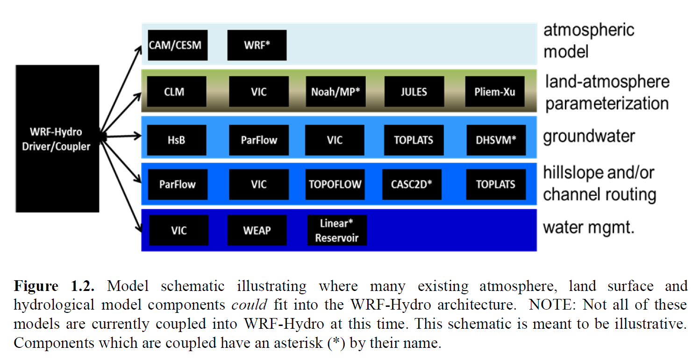
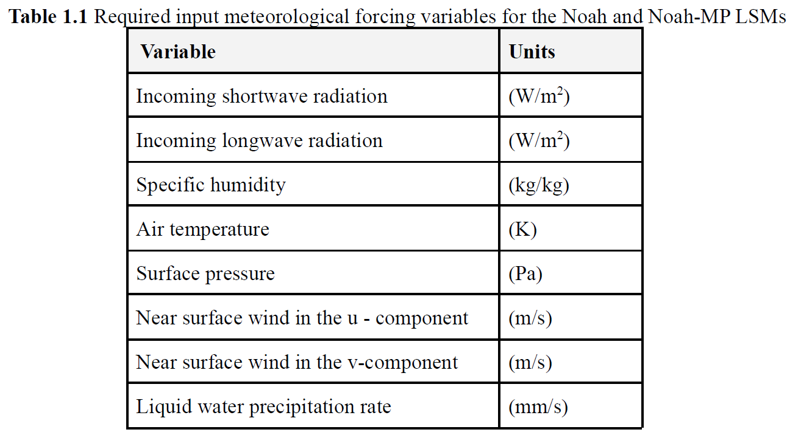
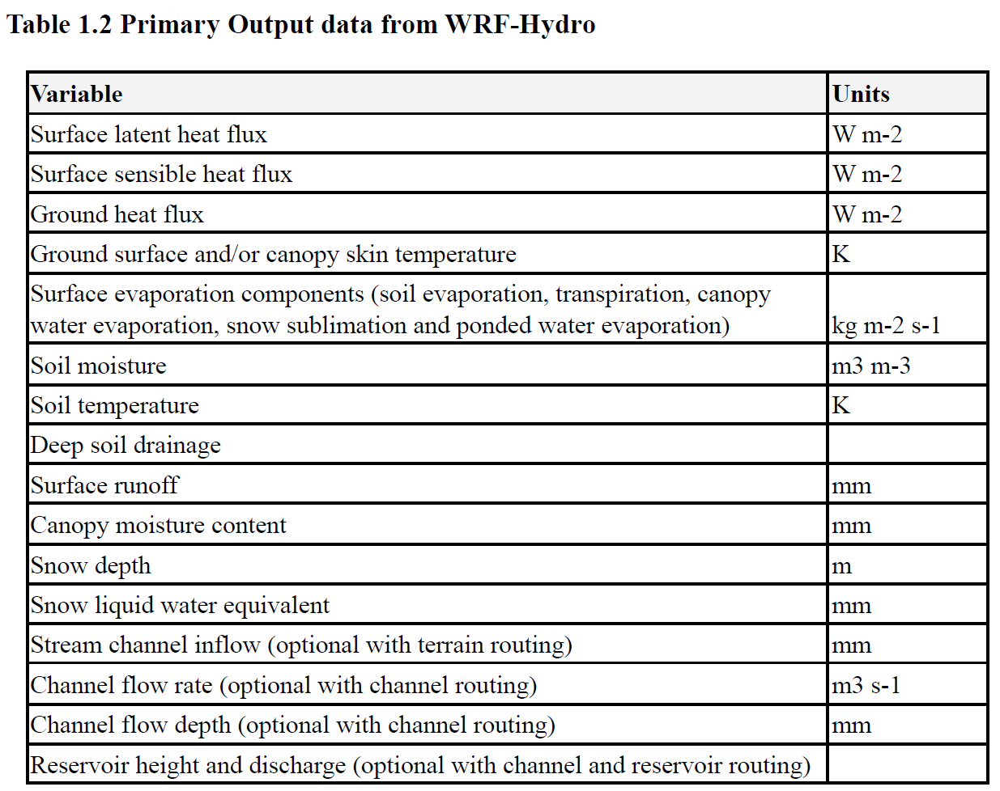
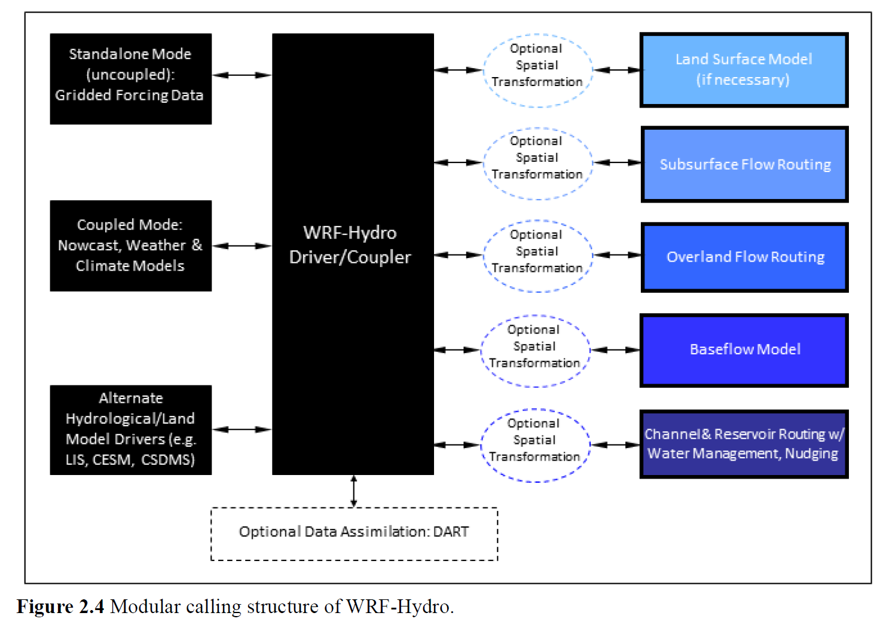
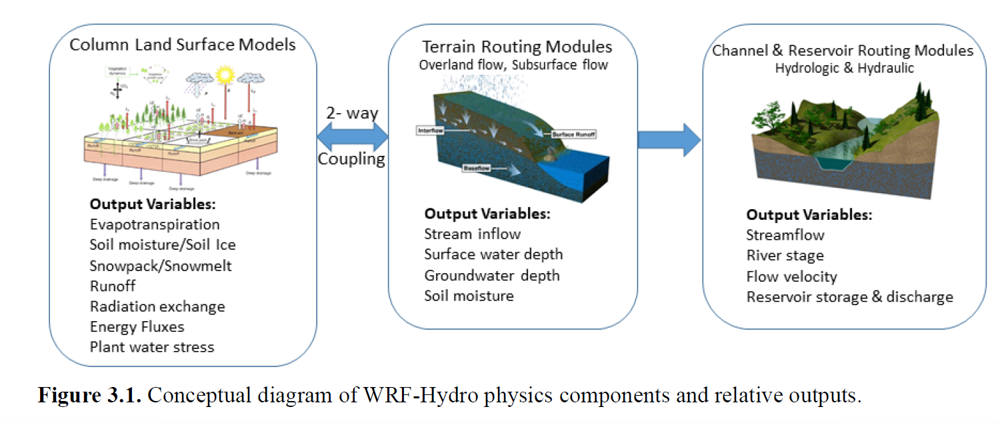

# wrf-hydro学习笔记
该笔记对应的学习资料为，The NCAR WRF-Hydro® Modeling System Technical Description，Version 5.2

## 1. Introduction

本文档是NCAR （National Center for Atmospheric Research）Weather Research and Forecasting model (WRF) hydrological modeling system (WRF-Hydro) 的physical parameterizations, numerical implementation, coding conventions, and software architecture的描述。

WRF-Hydro并不是一个单一的模型，而是一个模型架构，便于将多种可选的水文过程表示方法耦合在一起。
### 1.1 Brief History

WRF-Hydro 提供了一种将水文模型组件与大气模型和其他地球系统建模架构相结合的方法。Fortran 90编写。原始版本叫做Noah-distributed，包含一个分布式的，三维的，变饱和的地表和地下模型，2003。刚开始是将terrain routing，channel and reservoir routing函数整合到一维的Noah land surface model中。最早的模型方法在Gochis and Chen (2003)中描述，land surface model在粗网格上求解，terrain routing在细网格上求解，通过subgrid disaggregation-aggregation整合到一起。之后的发展，2D（in x and y）or 1D (D8方法) terrain routing，1D grid based hydraulic routing model, a reservoir model, 2个reach-based hydrologic channel routing models, 一个simple empirical baseflow estimation routine。2004年，该叫NCAR WRF-Hydro，和WRF中尺度气象模型耦合在一起，land surface hydrology和regional atmospheric model的全耦合。2011到2012，WRF-Hydro模型结构大改，更容易扩展和升级。

### 1.2 Model Description

WRF-Hydro的开发是为了促进地表水、地下水和渠道水等地表过程与大气模型的耦合。WRF-Hydro Switch-activated modules。WRF-Hydro在气候模型和水文模型与数据同化系统之间存在一个耦合技术，或者“middle ware”层。气候模型可以作为水文模型的输入，或者两者可以双向耦合。

WRF-Hydro is designed to enable improved simulation of land surface hydrology and energy states and fluxes at a fairly high spatial resolution (typically 1 km or less) using a variety of physics-based and conceptual approaches.

WRF-Hydro的主要物理选项包括，

* 1D （垂向）land surface parameterization

* surface overland flow 地表径流

* 变饱和流

* 渠道

* 水库

* 概念/经验基流

目前WRF-Hydro支持的陆面模型为Noah和Noah-MP，未来预计会支持其他。目前模型需要的气候驱动变量要求，

  采用耦合方式运行时，这些数据根据指定的频率由气候模型提供。当单独运行WRF-Hydro时，需要按照grided input time series提供。

GIS工具被用来处理河网，open water grid cells，和地下水/基流流域。

输出如下，但不限于

WRF-Hydro是针对linux开发的，可以移动到虚拟机或者容器中。需要netCDF。

WRF-Hydro是computationally-intensive的模型。小研究区（16 KM2）可以在PC上跑。
## 2. Model Code and Configuration Description

### 2.1 Brief code overview

hydro.namelist文件就是用来调换不同模块的

### 2.2 Driver level description

WRF-Hydro既可以被其他模型call，如WRF，也可以独立运行。每次新的耦合，都需要一些基本的设置，并且一般会有个新的文件夹。如处理与WRF模型耦合的代码在WRF-Hydro模型的WRF_cpl/文件夹中。

以下举例说明，

为了耦合WRF和WRF-Hydro，将WRF-Hydro编译为一个library function，比如叫wrf.exe。WRF-Hydro被WRF的surface driver module (phys/module_surface_driver.F) 直接call。管理通信的是WRF_drv_Hydro.F交互模块，包含在WRF_cpl/文件夹中。WRF_drv_Hydro.F交互模块是具体的“general WRF-Hydro Coupling Interface”，处理WRF与WRF-Hydro之间的数据传递，网格，和时间信息。WRF-Hydro内的部分再进行随后的计算。完成用户指定的计算后，WRF-Hydro会通过WRF_drv_Hydro.F将数据传回WRF。

WRF-Hydro需要netCDF library。

### 2.3 Parallelization strategy

WRF-Hydro代码的并行采用了与WRF模型类似的geographic domain decomposition和halo array passing structure。信息在不同处理器之间的传递由MPI协议完成。因此，在模型并行执行前，需要提前安装MPI libraries。目前不支持顺序编译，因此即使在单核运行也要安装MPI libraries。

### 2.4 Directory Structures

代码的最上层目录在trunk/NDHMS。下面是描述子目录的表

| File/directory name | Description |
| ------------------- | ----------- |
| **Main code files and directories** ||
| arc/ | 包含宏文件，用于指定编译配置，编译器选项，链接netCDF libraries等 |
| CPL/Noah_cpl/ | 包含WRF-Hydro耦合接口，用于将WRF-Hydro组件与offline的Noah陆面模型同化与预报系统耦合在一起 |
| CPL/NoahMP_cpl/ | 和上面一样，但是陆面模型是Noah-MP |
| CPL/WRF_cpl/ | 包含WRF-Hydro接口，用于耦合WRF-Hydro与WRF |
| CPL/CLM_cpl/, CPL/LIS_cpl/, CPL/NUOPC_cpl/ | 正在进行的耦合工作。尚不支持 |
| Data_Rec/ | 包含数据声明模块 data declaration modules |
| Debug_Utilities | Utilities for debugging |
| deprecated/ | 包含当前未使用的文件 |
| Doc/ | 指向完整文档（本文档）的指针 |
| HYDRO_drv/ | 包含高级WRF-Hydro组件驱动程序 module_HYDRI_drv.F |
| Land_models/Noah/ | 包含Noah land surface model驱动，适用独立或非耦合应用 |
| Land_models/NoahMP/ | 包含Noah-MP land surface model驱动，适用独立或非耦合应用 |
| MPP/ | 包含MPI的并行例程和函数 |
| nudging/ | 包含推导nudging data assimilation例程和函数 |
| Rapid_routing/ | 包含RAPID routing model耦合的必须文件。不支持了，因为RAPID版本已经过时 |
| Routing/ | 包含WRF-Hydro的specific routing processes的模块和驱动 |
| template/ | 包含Noah、Noah-MP、WRF-Hydro模块的example namelist files。对于Hydro也包含默认和示例参数表。Note: Noah和Noah-MP的参数表在Land_models的目录。这里还有一个 bash 脚本示例 (setEnvar.sh)，可以将其传递给编译脚本，列出 WRF-Hydro 的编译时选项。 |
| utils | 内部模型版本 |
| **Files:** |  |
| compile_offline_Noah.sh | 脚本，为了编译WRF-Hydro基于Noah的offline版本 |
| compile_offline_NoahMP.sh | 脚本，为了编译WRF-Hydro基于Noah-MP的offline版本 |
| configure | 配置WRF-Hydro编译的脚本 |
| Makefile | 最顶层的building和cleaning WRF-Hydro的makefile文件 |
| README.build.txt | WRF-Hydro独立模型创建说明 |
| wrf_hydro_config | 配置脚本耦合WRF和WRF-Hydro |
| *.json | 用来测试的JSON文件 |
| **Local files and directories created on configure/compile** |  |
| **Directories:** |  |
| lib/ | 编译的libraries写入的目录 |
| mod/ | 编译的.mod写入的目录 |
| LandModel/ | 配置脚本设置的符号链接，用于从Land models/中选择Land_Models（比如，选择Noah-MP时，LandModel->Land_Models/NoahMP） |
| LandModel_cpl | 配置脚本设置的符号链接，从CPL/.中选择land model（比如，选择Noah-MP时，LandModel_cpl->CPL/NoahMP_cpl） |
| Run/ | 模型可执行文件，示例参数表，编译模型配置的示例namelist的存放目录。这些文件在编译时会被覆盖。推荐用户将这个目录的内容拷贝到另外的地方，和代码分开，来运行模型 |
| **Files:** |  |
| macros | 由configure创建的宏定义文件，用于指定编译设置 |

下面是另一个表，在Routing/ 目录中，关于WRF-Hydro的routing processes的模块

| File/directory name              | Description                                                  |
| -------------------------------- | ------------------------------------------------------------ |
| Overland/                        | 包含overland routing模块的目录                               |
| Makefile                         | WRF-Hydro组件的makefile                                      |
| module_channel_routing.F         | 包含WRF-Hydro channel routing组件的模块                      |
| module_date_utilities_rt.F       | 为了routing routines的various date/time utilities的模块      |
| module_GW_baseflow.F             | 包含simple baseflow model物理模型的模块                      |
| model_HYDRO_io.F                 | 包含WRF-Hydro输入输出功能的模块                              |
| model_HYDRO_utils.F              | 包含WRF-Hydro几个utilities的模块                             |
| module_lsm_forcing.F             | 包含不同驱动数据类型选项的模块                               |
| module_noah_chan_param_init_rt.F | 初始化WRF-Hydro routing grids的模块                          |
| module_NWM_io.F                  | 包含输出模块的例程，用于生成符合CF标准的所需输出文件         |
| module_NWM_io_dict.F             | 支持CF标准的输出程序的Dictionary                             |
| module_RT.F                      | 包含calls来call WRF-Hydro程序初始化的模块                    |
| module_UDMAP.F                   | 用户自定义映射功能模块，目前用于NWM配置，NHDPlus网络         |
| Noah_distr_routing.F             | 包含overland flow和subsurface routines，以及网格分解例程的模块 |
| model_gw_gw2d.F                  | 包含实验的二维地下水模型的模块                               |

### 2.5 Model Sequence of  Operations

本节讲述WRF-Hydro的基本结构和顺序。由WRF-Hydro系统操作高级的任务管理（如时间管理，IO管理和模型完成），除非WRF-Hydro耦合进其他模型结构，且在另外的模型之下。WRF-Hydro可以call一个独立的land model驱动，比如the NCAR High Resolution Land Data Assimilation System的Noah和Noah-MP land surface models，来执行column land surface physics，或者由一个不同模型结构的模型call，如WRF，NCAR CESM，或者NASA LIS。当使用standalone或者uncoupled模式运行时，WRF-Hydro必须读取进行land surface model计算所需的meteorological forcing data，并且WRF-Hydro包含必要的例程。当和WRF或者其他大型结构一起run的时候，WRF-Hydro从父结构中获得meteorological forcing或者land surface states and fluxes。基本的执行过程如下所示，

1. 初始化时，将地表地形静态数据读入WRF-Hydro系统中，建立model domain和computational arrays

2. 依赖于run offline或者和其他模型耦合，读入forcing data，或者传入land surface states and fluxes

3. 对于需要land model执行的offline模拟，执行grided column land surface模型

4. 如果routing是激活的，并且land model grid和routing grid之间存在不同，那么将land surface states and fluxes分解为高分辨率的terrain routing grids

5. 如果处于激活状态，那么执行sub-surface routing physics

6. 如果处于激活状态，那么执行surface routing physics

7. 如果处于激活状态，那么执行conceptual base flow model

8. 如果处于激活状态，那么执行channel and reservior routing部分。目前在Muskingum-Cunge routing中，支持streamflow nudging功能

9. 从更高分辨率的terrain routing grid，聚合得到land surface model grid的结果，然后更新land surface states and fluxes。（如果routing是激活的，并且land surface grid和routing grid有不同）

10. 将结果写入输出，或者restart files，或者对于WRF/WRF-Hydro耦合模拟，返回WRF model

目前DA只支持离线模式

### 2.6 WRF-Hydro compile-time options

编译时间选项是一些关于模型编译时决定模型结构的选择。编译时间选择是从图2.4中的一些选择中得到的WRF-Hydro的实例。编译时间选择可以分为两类，（1）模型驱动是啥，（2）选则的驱动有哪些编译选项。在本文档中，我们将模型驱动限制为WRF，Noah和Noah-MP。standalone模型下配置，编译，运行WRF-Hydro，在网页上有详细描述。

编译时间选项在trunk/NDHMS/template/setEnvar.sh中。该脚本中的信息做了注释。正如路径所示，改脚本是模板文件。编辑时请注意复制（在版本控制外）。在trunk/NDHMS/compile.sh中的编译脚本可以接收setEnvar.sh中的用户设置的变量。用户也可以选择提供一个包含变量的文件作为脚本的第一个参数。如果使用make来rebuilding代码，推荐用户在编译步骤前，将变量放入环境中（比如in bash，通过获取包含变量的文件）。

### 2.7 WRF-Hydro run time options

有两个namelist文件，用户在执行standalone或者uncoupled模式时，为了保证顺利执行WRF-Hydro，一定要修改。一个是hydro.namelist文件，里面是操作所有routing组件的设置。这个文件的Comments非常详细。

第二个namelist指定使用的land surface model选项。这个namelist根据所选择耦合模型的不同可以改变。原因是，WRF-Hydro是“最小改变”其他陆面模型的设计。当WRF-Hydro编译时，合适的namelist.hrldas模板文件会被拷贝到run文件夹中。

在WRF-Hydro v5.2中，Noah和Noah-MP是主要的land surface model的选项。Noah和Noah-MP都使用一个叫namelist.hrldas的namelist文件。WRF的namelist是namelist.input。

## 3. Model Physics Description

本章节描述WRF-Hydro 5.0版本和“run time”指定的相关namelist选项背后的物理过程。

### 3.1 Physics Overview

首先，一维column land surface model计算垂向能量通量（显热和潜热，净辐射）、含水量（冠层拦截，入渗，超渗，深层渗漏）、和土壤热量和水分状态。随后，采用时间步长加权法（Gochis 和 Chen，2003 年），将超渗、积水深度和土壤含水量从空间分辨率通常为 1-4 千米的一维 LSM 网格分解为高分辨率（通常为 30-100 米）routing grid，并传递给subsurface和overland flow的terrain-routing模块。在典型的US案例中，1D LSM的land cover分类由USGS 24类 Land Use Land Cover产品或者MODIS Modified IGBP 20-category land cover product提供，土壤分类由1 km的STATSGO数据库提供，映射到STATSGO土壤分类的土壤水力参数由Cosby et al.(1984)指定。其他的land cover和soil type classification datasets也可以用于WRF-Hydro，但是用户有责任把这些分类映射到和USGS或MODIS的land cover和STATSGO土壤分类相同的分类。WRF模型的前处理系统（WRF model pre-processing system WPS）也提供了一个相当全面的land surface data，可以用来建立Noah和Noah-MP land surface models。也可以使用其他耦合进WRF-Hydro的land cover和soil datasets，最新的USGS的National Land Cover Dataset (NLCD)和国际土壤数据集。

之后WRF-Hydro中的subsurface lateral flow会先于overland flow routing计算，以便将完全饱和单元的渗出量加入到LSM计算出的infiltration excess。计算土柱饱和部分的lateral flux的方法是Wigmosta et al. (1994)和Wigmosta and Lettenmaier (1999)年提出，在Distributed Hydrology Soil Vegetation Model (DHSVM)中实施的。它计算quasi-3D流动，包括地形影响，饱和土壤深度，随深度变化的饱和Ks值。水力梯度是根据相邻网格地下水位坡度，可以是最陡峭的坡度，也可以是x和y方向的坡度。从一个单元到它下梯度单元一个时间步的水分通量，近似于一个稳态解。Subsurface flux发生在较粗糙的LSM网格，而overland flow发生在较细的网格。

之后，WRF-Hydro根据离地表最近的饱和土层顶部深度计算地下水位深度。举例，在WRF-Hydro中2m的土柱，最小要有4个土壤层，但是这并不是一个严格的要求。额外的离散可以提高对随时间变化的地下水位高度的分辨率，用户可以在附录A3、A4和A5描述的model namelist中修改土壤层数和厚度。

之后定义overland flow。Julien et al. (1995-CASC2D)提出，随后Ogden (1997)修改的fully unsteady，spatial explicit的扩散波计算方法是目前overland flow的可选方法，当模型单元上的水深超过指定的retention depth。扩散波方程考虑了backwater effects和反向坡度的流动。根据Julien et al. (1995)，overland flood wave的连续性方程是和栋梁方程合在一起的，使用Manning公式描述栋梁方程的阻力公式，并且Manning公式需要糙率系数。WRF-Hydro中的糙率系数从Vieux(2001)获得，并且映射到现有的由USGS 24-type land-cover产品和MODIS 20-type land cover产品提供的land cover分类，这和1D Noah/Noah-MP LSM使用的land cover分类数据集一致。

此外，还采用了其他模块来代表stream channel flow processes, lakes, reservoirs, 和stream baseflow。在WRF-Hydro V5.2中，河网和湖、水库等目标的入流是一个one-way process。Overland flow到达标记为“channel”的单元，会将超过该单元load ponded water retention depth的那部分水，传给channel模型。这种方式使得，从land surface到stream和lake的入流都是正向流入stream和lake单元的。目前没有channel和lake损失的功能，也就是从lake和channel流回到陆地。WRF-Hydro的channel flow，是通过用户从以下几种用户选择的方法中的一个描述。进入和通过湖泊和水库的水流采用简单的level pool routing方案。进入河网的基流使用一个流域概念的storage-discharge bucket model描述，从空间分布的陆地获得drainage流量。根据经验的出的storage-discharge关系，将从Bucket排出的排水量直接进入和河网。如果激活overland flow，那么进入buckets的水量仅有土壤排水，这是因为overland flow将直接将地表的水分排入channel模型。如果overland flow是关闭的，channel routing仍然开着，那么land model中超过地表入渗的水分，也会在预先定义的catchment收集起来，然后传入bucket。通过模型namelist file中的指定选项，可以启用上述每个过程选项。

### 3.2 Land model description: The community Noah and Noah-MP land surface models

Note: 写这个报告的时候，WRF-Hydro只支持Noah和Noah-MP land surface model。其他的如CLM、NASA LIS等Land model driver frameworks也会耦合进WRF-Hydro，但是这些都在不同的开发阶段，目前在主代码库中尚不支持。

Noah land surface model是一个community, 1D的land surface model, 模拟地球表面的土壤含水量（液态和含冰量），土壤温度，表面温度，雪深，积雪水当量，冠层水量，能量通量和水分通量。该模型历史悠久，其传统版本经过了广泛的测试和验证，尤其是在Project for Intercomparison of Land surface Parameterizations, the Global Soil Wetness Project和Distributed Model Intercomparison Project。Mahrt and Pan (1984)，Pan and Mahrt (1987)于80年代中期在Oregon State University开发了最早的版本。原始的OSU模型使用两层土壤模型和简单的作物冠层模型计算潜热和显热通量。在各个机构模型小组和大学社区的共同参与下，当前版本的Noah模型的发展和实施工作得以继续进行。Ek et al. (2003)详述了从发端以来的进化，一个四层的土壤代表（土壤层厚度位0.1，0.3，0.6和1m），修正冠层导度公式，裸土蒸发和植被物候，地表径流和入渗，表层交换系数中的热粗糙长度处理，和冻土过程。最新的有雪面能量均衡计算，地表反射率的季节性变化。

Noah land surface model在offline和coupled模式下都有大量的测试。最新版本的Noah是

